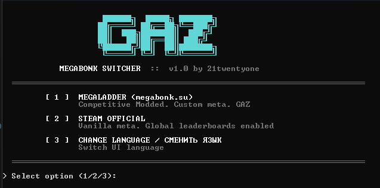
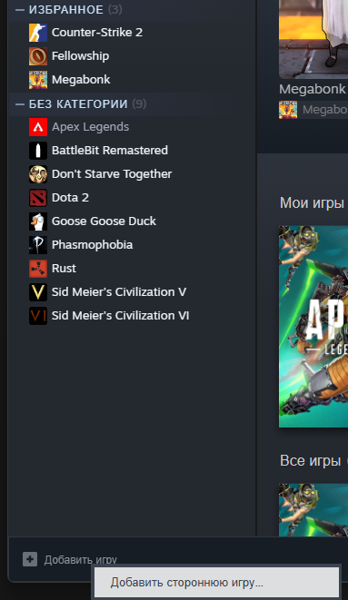
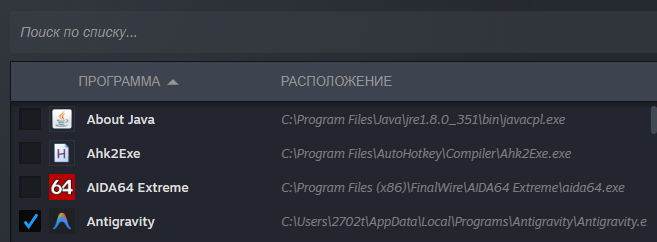
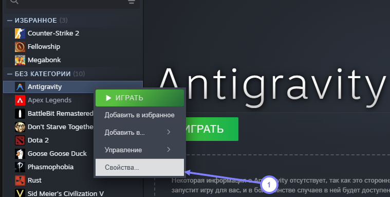
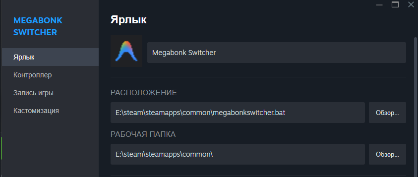
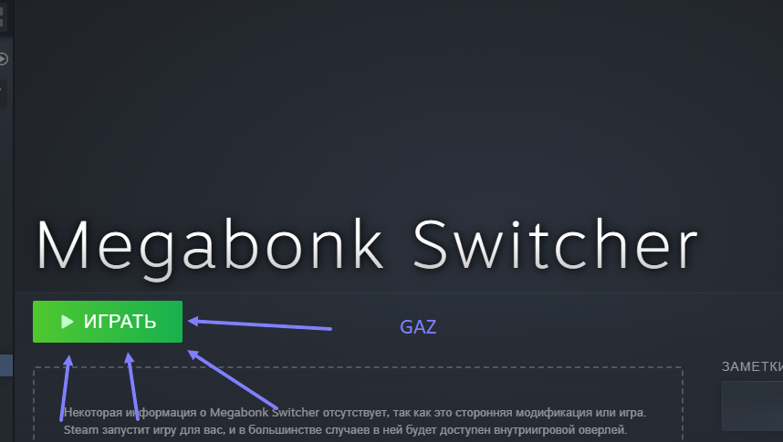

# Megabonk Switcher

[Русский](#russian) | [English](#english)

---

## 🇷🇺 Russian Description

**Megabonk Switcher** — это утилита для быстрого и удобного переключения между **Модифицированной (MegaLadder)** и **Оригинальной (Steam Official)** версиями игры Megabonk.

### Возможности:
- **Автоматическая настройка окружения**: При первом запуске скрипт сам создаст необходимые копии игры для ванильной и модифицированной версий.
- **Умное переключение**: Использует символические ссылки для мгновенной смены версий без копирования файлов.
- **Авто-конфигурация**: Автоматически меняет настройки игры (скрытие лидербордов, отправка счета) в зависимости от выбранного режима.
- **Запуск через Steam**: После выбора режима игра автоматически запускается через Steam.

### Как использовать:
1. **Важно:** Поместите файл `megabonkswitcher.bat` в папку `steamapps\common` (рядом с папкой `Megabonk`).
2. Запустите файл `megabonkswitcher.bat` (потребуются права администратора для создания ссылок).
3. Выберите режим:
   - **[1] MEGALADDER**: Для игры с модами и кастомной метой на megabonk.su. (Лидерборды STEAM отключены).
   - **[2] STEAM OFFICIAL**: Для игры в оригинальную версию с глобальными таблицами лидеров в STEAM.
4. Дождитесь запуска игры.

### 🎮 Добавление в Steam

Чтобы запускать свитчер прямо из Steam, выполните следующие действия:

1. Откройте библиотеку Steam.
2. В нижнем левом углу нажмите **«Добавить игру»** -> **«Добавить стороннюю игру...»**.
   
3. В открывшемся окне нажмите **«Обзор...»** и выберите **любой файл** (например, любой .exe), чтобы просто добавить что-то в список.
   
4. Найдите добавленную игру в списке слева, нажмите на неё правой кнопкой мыши и выберите **«Свойства...»**.
   
5. Измените следующие поля:
   - **Расположение**: Укажите полный путь к вашему файлу `megabonkswitcher.bat`.  
     *Пример:* `"E:\steam\steamapps\common\megabonkswitcher.bat"`
   - **Рабочая папка**: Укажите папку, в которой лежит этот .bat файл.  
     *Пример:* `"E:\steam\steamapps\common"`
   - Вы также можете изменить название игры и иконку на желаемые.
   
6. Теперь запускайте Megabonk Switcher прямо из библиотеки Steam!
   

### ❓ Частые вопросы (FAQ)

**Q: Обязательно ли теперь запускать игру только через свитчер?**  
**A:** Нет. Свитчер необходим только для **смены** версии (перехода с официальной версии на MegaLadder или наоборот). После того как нужная версия выбрана, вы можете запускать игру привычным способом — через библиотеку Steam или ярлык на рабочем столе.

**Q: Безопасна ли программа? Есть ли риск бана?**  
**A:** Использование свитчера безопасно. Программа не вмешивается в код игры или память процесса. Она работает исключительно на уровне файловой системы: подменяет папку с файлами мода и корректирует пару настроек.

**Q: Как полностью удалить свитчер и вернуть оригинальную игру?**  
**A:** Просто выберите режим **[2] STEAM OFFICIAL** в свитчере перед удалением. Это вернет оригинальные файлы игры на место. Если вы случайно удалили свитчер, находясь в модифицированной версии — не страшно, просто выполните «Проверку целостности файлов» в свойствах игры в Steam.

---

## 🇺🇸 English Description

**Megabonk Switcher** is a utility designed for seamless switching between the **Modded (MegaLadder)** and **Vanilla (Steam Official)** versions of Megabonk.

### Features:
- **Auto-Environment Setup**: Automatically creates separate directories for Vanilla and Modded versions upon first launch.
- **Smart Switching**: Uses symbolic links to switch game versions instantly without copying large files.
- **Auto-Configuration**: Automatically updates game settings (hiding leaderboards, score submission) based on the selected mode.
- **Steam Launch**: Automatically launches the game via Steam after selecting a mode.

### How to Use:
1. **Important:** Place the `megabonkswitcher.bat` file into your `steamapps\common` folder (next to the `Megabonk` directory).
2. Run `megabonkswitcher.bat` (Administrator privileges are required for symbolic linking).
3. Select a mode:
   - **[1] MEGALADDER**: For modded gameplay with custom meta at megabonk.su. (Steam Leaderboards disabled).
   - **[2] STEAM OFFICIAL**: For the original experience with Steam Leaderboards enabled.
4. Wait for the game to launch.

### 🎮 How to Add to Steam

To launch the switcher directly from Steam, follow these steps:

1. Open your Steam Library.
2. Click **"Add a Game"** in the bottom-left corner -> **"Add a Non-Steam Game..."**.
   
3. Click **"Browse..."** and select **any file** (e.g., any .exe file) just to add an entry to the list.
   
4. Locate the newly added game in your library list, right-click it, and select **"Properties..."**.
   
5. Edit the following fields:
   - **Target**: Enter the full path to your `megabonkswitcher.bat` file.  
     *Example:* `"E:\steam\steamapps\common\megabonkswitcher.bat"`
   - **Start In**: Enter the folder containing the .bat file.  
     *Example:* `"E:\steam\steamapps\common"`
   - You can also change the name and icon to whatever you prefer.
   
6. Launch Megabonk Switcher directly from your Steam Library!
   

### ❓ Frequently Asked Questions (FAQ)

**Q: Do I have to launch the game via the switcher every time?**  
**A:** No. The switcher is only needed when you want to **change** versions (switching from Official to MegaLadder or vice versa). Once the desired version is selected, you can launch the game as usual — via your Steam Library or a desktop shortcut.

**Q: Is this program safe? Will I get banned?**  
**A:** Using the switcher is completely safe. It does not inject code into the game or modify process memory. It works strictly at the file system level: it swaps the mods folder and adjusts a few settings.

**Q: How do I completely remove the switcher and restore the original game?**  
**A:** Simply select **[2] STEAM OFFICIAL** mode in the switcher before deleting it. This restores the original game files. If you accidentally deleted the switcher while in modded mode, don't worry — just run "Verify integrity of game files" in the game's Steam properties.
